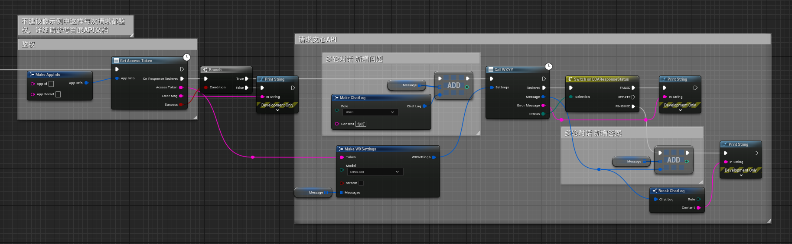

# UE5 文心一言 API

这是文心大模型的API UE5 插件.

## 更新

* ### 增加模型选择

    > ERNIE-Bot
    >
    > ERNIE-Bot-turbo

* ### 增加鉴权节点

    > GetAccessToken

### 用法示例

图示仅为方便节点说明，请根据具体需求使用。

* 如有疑问请参考 [百度 API 文档](https://cloud.baidu.com/doc/WENXINWORKSHOP/s/flfmc9do2)

* 更好的修改请告诉我。
* Email:<5120011@qq.com>

[License](LICENSE)
